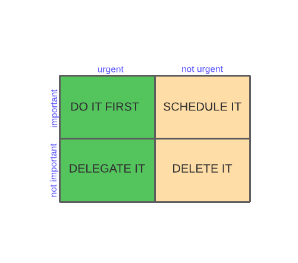

<h1 align="center"><a href="#" alt="cookin">Task List API</a> ✅</h1>

<h2>Contents</h2>

- [1. About 💻](#1-about-)
- [2. Entity-Relationship Diagram ↔️](#2-entity-relationship-diagram-️)
- [3. Application's links 🔗](#3-applications-links-)
- [4. General Functionalities ⚙️](#4-general-functionalities-️)
- [5. Technologies 🧰](#5-technologies-)
  - [5.1 Requisites ☑️](#51-requisites-️)
- [6. Terms of Use 📜](#6-terms-of-use-)

## 1. About 💻

**_Task List_** is a basic CRUD (create, read, update and delete) application that focuses on creating and managing a task list. Each task can be created with 1 one or more categories corresponding to the task subject.

The user can create tasks and categories as well as update them and also delete. The user can retrieve the categories with their corresponding tasks.

Once the tasks are created they are automatically classificated by importance according to the "Eisenhower Principle", that utilizes the principles of importance and urgency to organize priorities and workload.

  

The classification is based on the importance and urgency values provided when the tasks are created or updated.

This API contains 7 endpoints. For more detailed information about the API and its endpoints, please consult API Documentation in Application links section.

## 2. Entity-Relationship Diagram ↔️

  

## 3. Application's links 🔗

## 4. General Functionalities ⚙️

## 5. Technologies 🧰

- <a name="python" href="https://docs.python.org/3/" target="_blank">Python</a>
- <a name="flask" href="https://flask.palletsprojects.com/en/2.0.x/" target="_blank">Flask</a>
- <a name="python.env" href="https://pypi.org/project/python-dotenv/" target="_blank">python-dotenv</a>
- <a name="flask=sql" href="https://flask-sqlalchemy.palletsprojects.com/en/2.x/" target="_blank">Flask SQLAlchemy</a>
- <a name="postgreSQL" href="https://www.postgresql.org/docs/" target="_blank">PostgreSQL</a>
- <a name="flask-m" href="https://flask-migrate.readthedocs.io/en/latest/" target="_blank">Flask Migrate</a>

### 5.1 Requisites ☑️

- Python above version 3.9.6;
- Package manager <a name="pip" href="https://pip.pypa.io/en/stable/" target="_blank">PIP</a>;
- PostgreSQL database;

## 6. Terms of Use 📜

This is an Open Source project for educational and non-commercial purposes.

**License type**: <a name="gpl" href="https://www.gnu.org/licenses/gpl-3.0.en.html" target="_blank">GPL</a>
